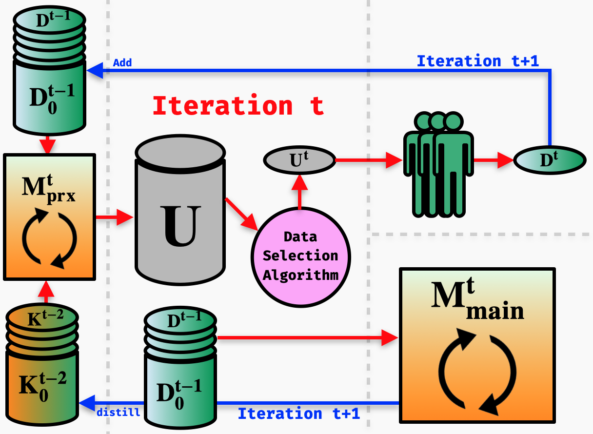
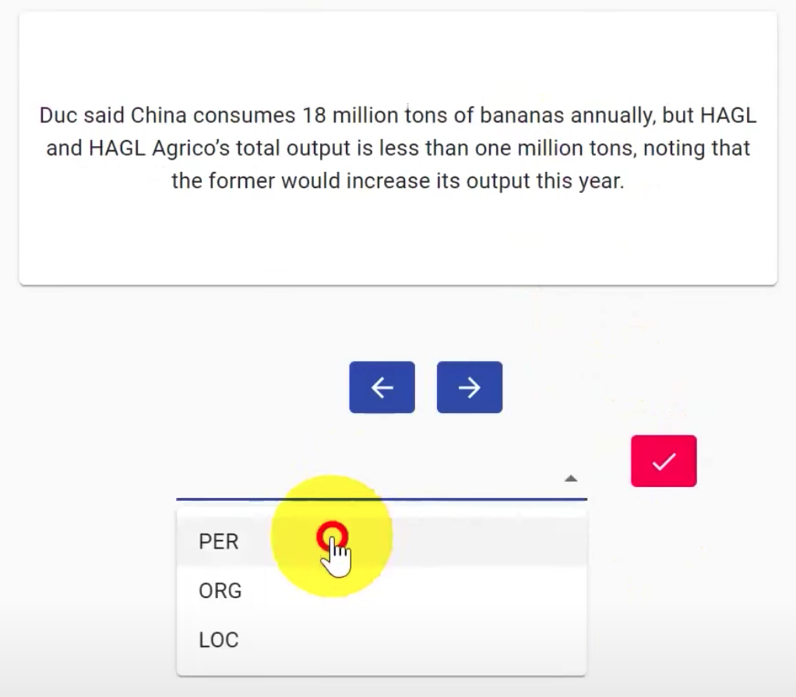
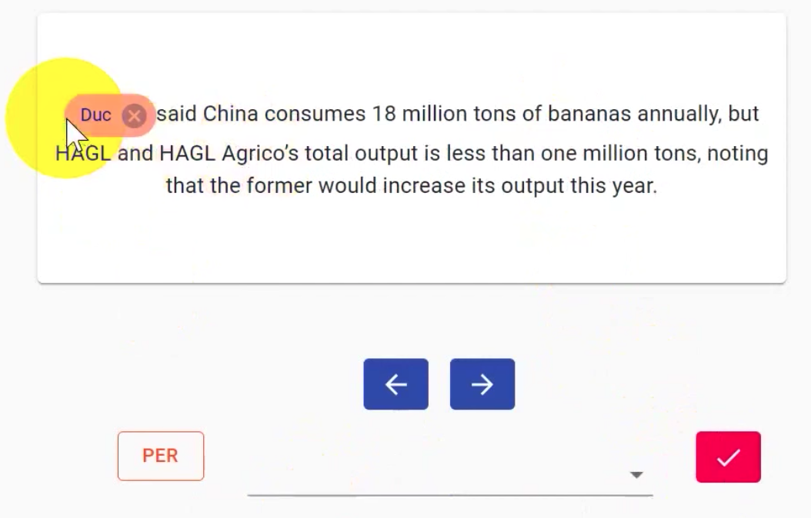
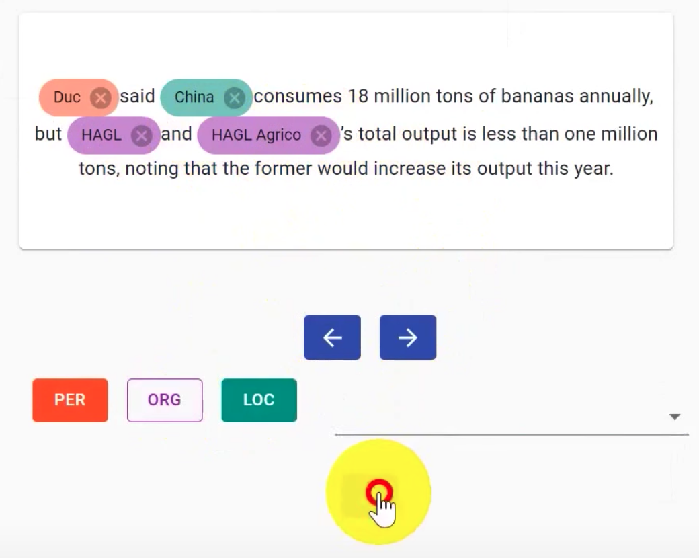
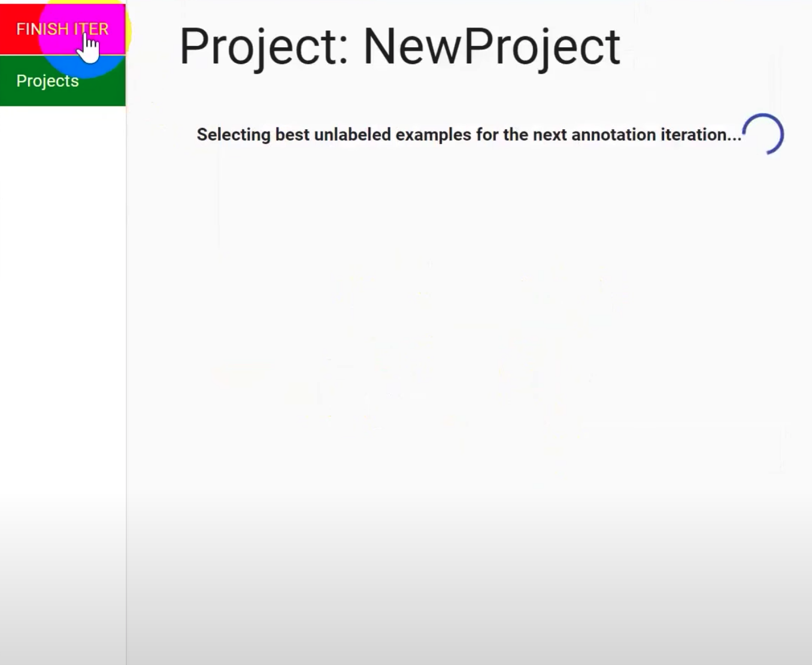

<h2 align="center">FAMIE: A Fast Active Learning Framework for Multilingual Information Extraction</h2>

<div align="center">
    <a href="https://github.com/nlp-uoregon/famie/blob/master/LICENSE">
        
    </a>
    <a href='https://famie.readthedocs.io/en/latest/?badge=latest'>
    
    </a>
    <a href="http://nlp.uoregon.edu:9000/">
        
    </a>
    <a href="https://pypi.org/project/famie/">
        
    </a>
    <a href="https://pypi.org/project/famie/">
        
    </a>
</div>

### Introduction

FAMIE is a comprehensive  and efficient [active learning]() (AL) toolkit for multilingual information extraction (IE). FAMIE is designed to address a fundamental problem in existing AL frameworks where annotators need to wait for a long time between annotation batches due to the time-consuming nature of model training and data selection at each AL iteration. With a novel proxy AL mechanism and the integration of our SOTA multilingual toolkit [Trankit](https://github.com/nlp-uoregon/trankit), FAMIE can quickly provide users with a labeled dataset and a ready-to-use model for different IE tasks over [100 languages](https://trankit.readthedocs.io/en/latest/pkgnames.html#trainable-languages).

FAMIE's documentation page: https://famie.readthedocs.io

FAMIE's demo website: http://nlp.uoregon.edu:9000/

The main features of **FAMIE** are:

+ Wide-support: FAMIE supports multilingual IE tasks for over 100 languages with a state-of-the-art set of active learning algorithms.

+ Fast Active Learning: FAMIE significantly reduces idle times of annotators in an AL procedure by introducing a compact proxy model to select unlabeled samples while parallelizing the retraining of the large-scale main model and annotation process.

+ Model-centric: In an AL procedure, the resulting labeled dataset is coupled with the main model involved in the selection process (ie. best performance can only be achieved by retraining the exact model on this dataset). However, previous AL toolkits focus only on their web interfaces to produce labeled data with no access to the corresponding model. In contrast, FAMIE provides a simple and intuitive code interface for interacting with **both** the produced labeled dataset and the trained main model after the AL process.

#### Proxy Active Learning
<p float="left" align="middle">
  
</p>

Incorporating current large-scale language models into traditional AL process would dramatically increase the model training time, thus introducing a long idle time for annotators that might reduce annotation quality and
quantity. To address this issue without sacrificing final performance, FAMIE introduces **Proxy Active Learning**. In particular, a small proxy model is used to unlabeled data selection, while the main model is trained during the long annotation time of the annotators (i.e., main model training and data annotation are done in parallel). Given the main model trained at previous iteration, knowledge distillation will be employed to synchronize the knowledge between the main and proxy models at the current iteration.


#### Active Learning Algorithm
Currently, **FAMIE** supports the following data selection algorithms for active learning:

+ Uncertainty-based ([MNLP](https://arxiv.org/abs/1707.05928)) select examples for annotation according to the main model’s length-normalized confidence over the predicted tag sequences for unlabeled examples

+ Diversity-based ([BERT-KM](https://aclanthology.org/2020.emnlp-main.637/)) uses K-Means to cluster
the examples in unlabeled data based on the contextualized embeddings of the sentences

+ Hybrid ([BADGE](https://arxiv.org/abs/1906.03671)) chooses examples from clusters of gradient embeddings, which are formed with the token representations from the penultimate layer of the main
model and the gradients of the cross-entropy loss
with respect to such token representations

<!-- We provide comprehensive experiments to suggest which algorithms user should choose. See [Data Selection Algorithms]() -->

### Installation
FAMIE can be easily installed via one of the following methods:
#### Using pip
```
pip install famie
```
The command would install FAMIE and all dependent packages automatically. 

#### From source
```
git clone https://github.com/nlp-uoregon/famie.git
cd famie
pip install -e .
```
This would first clone our github repo and install FAMIE.

### Usage
FAMIE currently supports Named Entity Recognition and Event Detection for over [100 languages](https://trankit.readthedocs.io/en/latest/pkgnames.html#trainable-languages). Using FAMIE includes three following steps:
- Start an annotation session.
- Annotate data for a target task.
- Access the labeled data and a ready-to-use model returned by FAMIE.

#### Starting an annotation session
To start an annotation session, please use the following command:
```python
famie start
```
This will run a server on users' local machines (no data or models will leave users' local machines), users can access FAMIE's web interface via the URL: http://127.0.0.1:9000/
. As FAMIE is an AL framework, it provides different data selection algorithms that recommend users the most beneficial examples to label at each annotation iteration. This is done via passing an optional argument `--selection [mnlp|badge|bertkm|random]`.

#### Annotating data

<!-- After initiating a new project and uploading an unlabeled dataset file with a entity type file (in text format), annotators are presented with a data statistic page. clicking on the bottom left conner would start the labeling process.

for each sample, annotators first select a label from dropdown, then proceed to highlight appropriate spans for the corresponding labels.
Continue till no more entity in given example, proceed by clicking save button and next arrow
After finishing labled all current  -->
After initiating a new project and uploading an unlabeled dataset file with an entity types file (in text format), annotators can start the annotation process.
Given one annotation batch in an iteration, annotators label one sentence at a time, annotating the word spans for each label by first choosing the label and then highlighting the appropriate spans. Also, FAMIE designs the size of the annotation batches to allow enough time to finish the training of the main model during the annotation time at each iteration.
<p align="middle">
  <!--  -->
  <!--   -->
  
  <!--  -->
</p>

After finishing each iteration, FAMIE then allows users to download the trained models and annotated data of the current round via the web interface.
<p align="middle">
  
</p>

#### Accessing the labeled data and the trained model with **famie** package

FAMIE also provides a simple and intuitive code
interface for interacting with the resulting labeled
dataset and trained main models after the AL processes.

```python
import famie

# access a project via its name
p = famie.get_project('named-entity-recognition') 

# access the project's labeled data
data = p.get_labeled_data() # a Python dictionary

# export the project's labeled data to a file
p.export_labeled_data('data.json')

# export the project's trained model to a file
p.export_trained_model('model.ckpt')

# access the project's trained model
model = p.get_trained_model()

# access a trained model from file
model = famie.load_model_from_file('model.ckpt')

# use the trained model to make predictions
model.predict('Oregon is a beautiful state!')
# ['B-Location', 'O', 'O', 'O', 'O']
```
