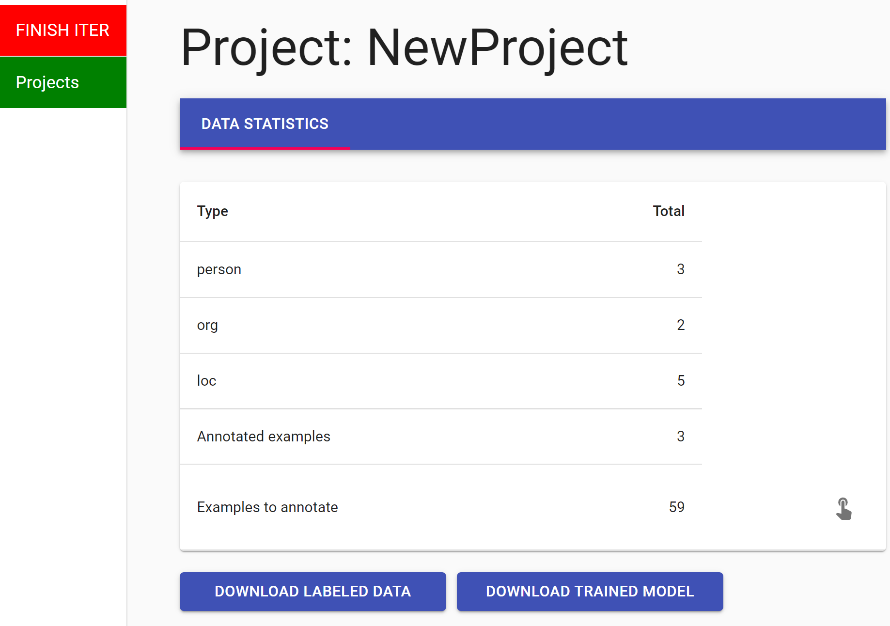

<h2 align="center">FAMIE: A Fast Active Learning Framework for Multilingual Information Extraction</h2>

<div align="center">
    <a href="https://github.com/nlp-uoregon/famie/blob/master/LICENSE">
        
    </a>
    <a href='https://famie.readthedocs.io/en/latest/?badge=latest'>
    
    </a>
    <a href="http://nlp.uoregon.edu:9000/">
        
    </a>
    <a href="https://pypi.org/project/famie/">
        
    </a>
    <a href="https://pypi.org/project/famie/">
        
    </a>
</div>

### Introduction

FAMIE is a comprehensive  and efficient **active learning** (AL) toolkit for **multilingual information extraction** (IE). FAMIE is designed to address a fundamental problem in existing AL frameworks where annotators need to wait for a long time between annotation batches due to the time-consuming nature of model training and data selection at each AL iteration. With a novel [proxy AL mechanism](https://famie.readthedocs.io/en/latest/howitworks.html) and the integration of our SOTA multilingual toolkit [Trankit](https://github.com/nlp-uoregon/trankit), **it takes FAMIE only a few hours to provide users with a labeled dataset and a ready-to-use model for different IE tasks over [100 languages](https://trankit.readthedocs.io/en/latest/pkgnames.html#trainable-languages)**.

If you use FAMIE in your research or products, please cite our following paper:
```bibtex
@misc{vannguyen2022famie,
      title={FAMIE: A Fast Active Learning Framework for Multilingual Information Extraction}, 
      author={Nguyen, Minh Van and Ngo, Nghia Trung and Min, Bonan and Nguyen, Thien Huu},
      year={2022},
      eprint={2202.08316},
      archivePrefix={arXiv},
      primaryClass={cs.CL}
}
```

FAMIE's technical paper: https://arxiv.org/pdf/2202.08316.pdf

FAMIE's documentation page: https://famie.readthedocs.io

FAMIE's demo website: http://nlp.uoregon.edu:9000/

### Installation
FAMIE can be easily installed via one of the following methods:
#### Using pip
```
pip install famie
```
The command would install FAMIE and all dependent packages automatically. 

#### From source
```
git clone https://github.com/nlp-uoregon/famie.git
cd famie
pip install -e .
```
This would first clone our github repo and install FAMIE.

### Usage
FAMIE currently supports Named Entity Recognition and Event Detection for over [100 languages](https://trankit.readthedocs.io/en/latest/pkgnames.html#trainable-languages). Using FAMIE includes three following steps:
- Start an annotation session.
- Annotate data for a target task.
- Access the labeled data and a ready-to-use model returned by FAMIE.

#### Starting an annotation session
To start an annotation session, please use the following command:
```python
famie start
```
This will run a server on users' local machines (no data or models will leave users' local machines), users can access FAMIE's web interface via the URL: http://127.0.0.1:9000/

To use FAMIE on a remote server for a local machine, users can run famie on the corresponding server and ssh-forward famie's port (9000) from their local machine:
```bash
# On remote
famie start
# On local
ssh -NL <local-port>:localhost:<famie-port> <remote-username>@<remote-address>
# Open localhost:9000 on local to access FAMIE's web interface.
```

To use FAMIE on google colab, use [colab-ssh](https://stackoverflow.com/a/61682149) to create an ssh connect to the Colab VM. Then follow the same remote-local process above to run FAMIE on the colab notebook through your local machine.
```bash
# On Colab Notebook
## Install colab_ssh and run ngrok to get ssh address and port
!pip install colab_ssh --upgrade
from colab_ssh import launch_ssh
launch_ssh('YOUR_NGROK_AUTH_TOKEN', 'SOME_PASSWORD')  # return a ssh-address and ssh-port
## Run FAMIE
famie start --port <famie-port>

# On local
ssh -NL <local-port>:localhost:<famie-port> root@<ssh-address> -p <ssh-port>
# Open localhost:<local-port> on local to access FAMIE's web interface.
```

. As FAMIE is an AL framework, it provides different data selection algorithms that recommend users the most beneficial examples to label at each annotation iteration. This is done via passing an optional argument `--selection [mnlp|badge|bertkm|random]`.

#### Annotating data
After initiating a new project and uploading an unlabeled dataset file with an entity types file (in text format), annotators can start the annotation process.
Given one annotation batch in an iteration, annotators label one sentence at a time, annotating the word spans for each label by first choosing the label and then highlighting the appropriate spans.
<p align="middle">
  <!--  -->
  <!--   -->
  
  <!--  -->
</p>

After finishing each iteration, FAMIE then allows users to download the trained models and annotated data by clicking on the buttons **DOWNLOAD LABELED DATA** and **DOWNLOAD TRAINED MODEL**.
<p align="middle">
  
</p>

#### Accessing labeled data and trained models

FAMIE also provides a simple and intuitive code
interface for interacting with the resulting labeled
dataset and trained main models after the AL processes.

```python
import famie

# access a project via its name
p = famie.get_project('named-entity-recognition') 

# access the project's labeled data
data = p.get_labeled_data() # a Python dictionary

# export the project's labeled data to a file
p.export_labeled_data('data.json')

# export the project's trained model to a file
p.export_trained_model('model.ckpt')

# access the project's trained model
model = p.get_trained_model()

# access a trained model from file
model = famie.load_model_from_file('model.ckpt')

# use the trained model to make predictions
model.predict('Oregon is a beautiful state!')
# ['B-Location', 'O', 'O', 'O', 'O']
```
